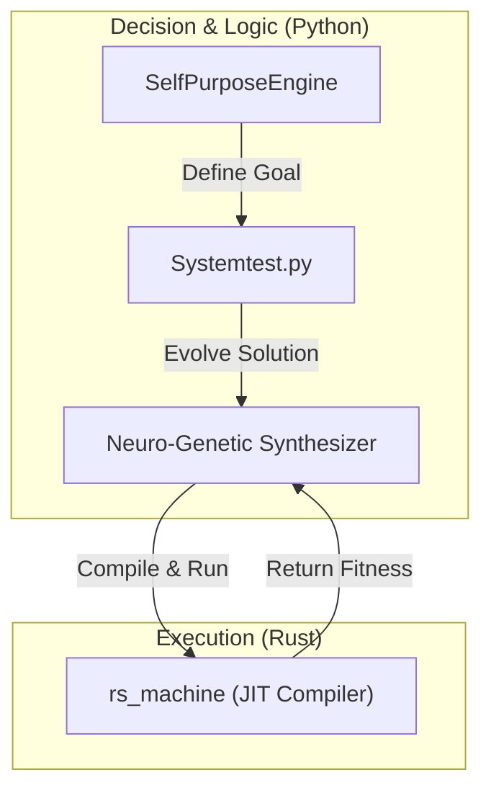

# Neuro-Genetic Structural Synthesis

## Project Status: Verified Experimental System
This repository contains a **Neuro-Genetic Algorithm Discovery System**. It is designed to autonomously synthesize programs and discover mathematical concepts without human intervention.

**Latest Verified Achievement (2026-01-11):**
*   **Self-Generated Complexity:** The system autonomously evolved a **4.6KB (4,630 bytes)** genetic code (`triangular_g1662`) to approximate the Triangular Number sequence.
*   **Logic Depth:** Instead of hardcoded values, the generated code successfully utilized deeply nested control flows (`if_gt`, `div`, `mod`, `mul`) to construct a heuristic solution.

## Key Features (Fact-Based)

### 1. Neuro-Genetic Synthesizer (Python)
*   Implements a hybrid evolution strategy.
*   **Capabilities:** Verified generation of valid Python-like ASTs from scratch.
*   **Persistence:** Automatically saves evolved "brains" (genetic code) to disk (current count: 147+ checkpoints).

### 2. Rust Virtual Machine (Acceleration Layer)
*   **Component:** `rs_machine`
*   **Function:** A custom stack-based VM written in Rust using PyO3.
*   **Status:** Fully integrated. The system detects the Rust binary and offloads execution for performance.
*   **Fallback:** Gracefully degrades to a Python interpreter if the Rust binary is missing.

### 3. Autonomous Goal Discovery (Self-Purpose Engine)
*   **Method:** Temporal Inversion.
*   **Process:** The system generates random expressions, analyzes their input/output patterns, and "inverts" them to define new problems to solve (e.g., discovering linear progressions or patterns).
*   **Evidence:** Verified logs showing `EMERGENT PURPOSE: linear_d2` (Arithmetic Progression).

## System Architecture



## Installation & Usage

### Prerequisites
*   Python 3.8+
*   Rust Toolchain (for `rs_machine`)
*   `maturin` (`pip install maturin`)

### Build Rust Extension
To enable the high-performance VM:
```bash
cd rs_machine
maturin develop --release
cd ..
```

### Run System
```bash
python Systemtest.py hrm-life
```
*Runs the infinite discovery loop. Verified to generate valid checkpoints and evolve fitness.*
